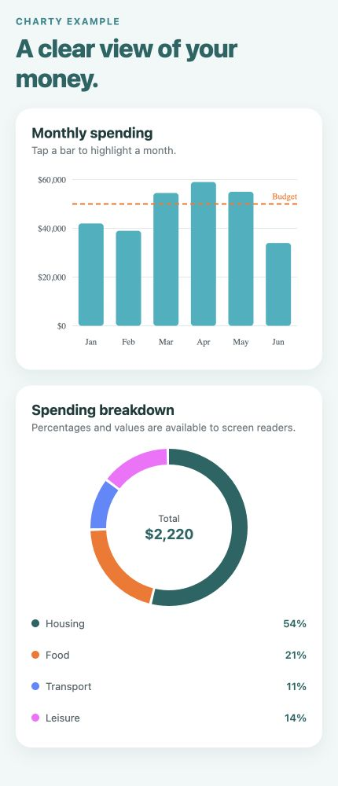
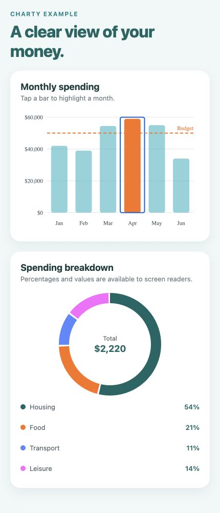

# Charty

Accessible, responsive charts for financial React Native and Expo apps.

Charty is deliberately small. It focuses on polished budget and allocation
visualizations without imposing a design system on your application.

Charty is **React Native first**. iOS and Android through React Native or Expo
are the primary supported targets. React Native Web compatibility is maintained
as a convenience for documentation and browser-based previews.

> Charty is being prepared for its first public npm release. The API may change
> before version 1.0.

## Preview

These screenshots come from the local Expo example used to validate the same
components bundled for iOS and Android.

| Overview | Selected month |
| :---: | :---: |
|  |  |

## Features

- Responsive layouts that use the width of their container
- TypeScript-first public API
- VoiceOver and TalkBack labels for every data point
- Empty and invalid data handling
- Theme, color, number, and currency customization
- React Native CLI and Expo compatibility through `react-native-svg`

## Installation

```sh
npm install @dansalomon/charty react-native-svg
```

With Expo, let Expo select the compatible SVG version:

```sh
npx expo install react-native-svg
npm install @dansalomon/charty
```

## Budget bar chart

```tsx
import { BarChart } from '@dansalomon/charty';

const currency = new Intl.NumberFormat('en-US', {
  style: 'currency',
  currency: 'USD',
  maximumFractionDigits: 0,
});

export function MonthlyBudget() {
  return (
    <BarChart
      accessibilityLabel="Monthly spending compared with budget"
      data={[
        { label: 'Jan', value: 42_000 },
        { label: 'Feb', value: 39_000 },
        { label: 'Mar', value: 54_500 },
        { label: 'Apr', value: 59_000 },
      ]}
      formatValue={currency.format}
      referenceLine={{ value: 50_000, label: 'Budget' }}
      onBarPress={(item) => console.log(item)}
    />
  );
}
```

## Spending donut

```tsx
import { DonutChart } from '@dansalomon/charty';

export function SpendingBreakdown() {
  return (
    <DonutChart
      accessibilityLabel="Spending by category"
      data={[
        { label: 'Housing', value: 1_200, color: '#0F6564' },
        { label: 'Food', value: 460, color: '#FD7119' },
        { label: 'Transport', value: 240, color: '#5A88FF' },
      ]}
    />
  );
}
```

`PieChart` remains available as a deprecated alias for the previous prototype.
New code should use `DonutChart`.

## Development

```sh
npm install
npm run verify
```

The Expo app in [`example`](./example) demonstrates both charts with responsive
cards and localized currency formatting.

## Contributing

Bug reports and focused pull requests are welcome. Read
[`CONTRIBUTING.md`](./CONTRIBUTING.md) before proposing a new chart type.

## License

MIT
