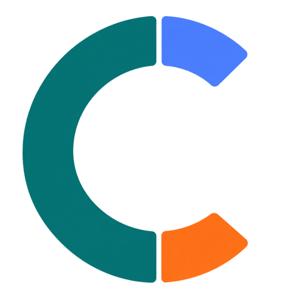
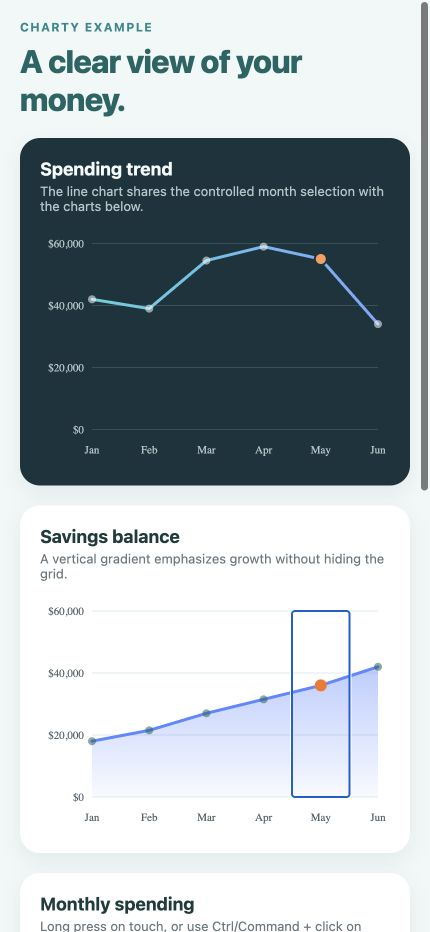
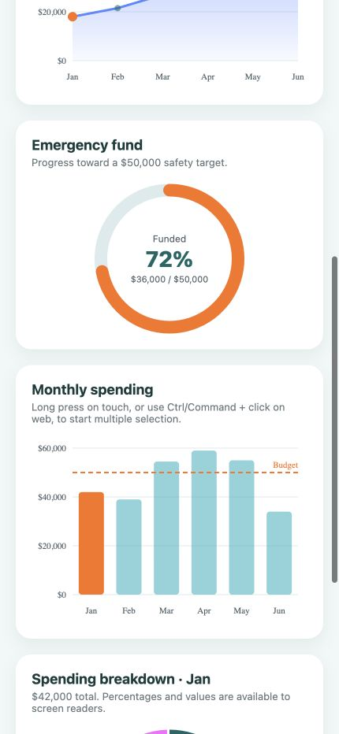

<p align="center">
  
</p>

# Charty for React Native

[](https://www.npmjs.com/package/@dansalomon/charty)
[](https://www.npmjs.com/package/@dansalomon/charty)
[](https://github.com/dansalomon2015/charty/actions/workflows/ci.yml)
[](./LICENSE)

Accessible, responsive charts for financial React Native and Expo apps.

Charty is deliberately small. It focuses on polished budget and allocation
visualizations without imposing a design system on your application.

Charty is **React Native first**. iOS and Android through React Native or Expo
are the primary supported targets. React Native Web compatibility is maintained
as a convenience for documentation and browser-based previews.

> This open-source library is not affiliated with the independent
> [Charty for Shortcuts](https://chartyios.app/) iOS application.

> The API may evolve before version 1.0. See the
> [changelog](./CHANGELOG.md) for release details.

## Preview

These screenshots come from the local Expo example used to validate the same
components bundled for iOS and Android.

<p align="center">
  
</p>

| January selected | April selected |
| :---: | :---: |
|  |  |

## Features

- Responsive layouts that use the width of their container
- TypeScript-first public API
- VoiceOver and TalkBack labels for every data point
- Empty and invalid data handling
- Theme, color, number, and currency customization
- Built-in light and dark themes
- Optional line and area gradients
- Goal visualization with `ProgressRing`
- Controlled single and opt-in long-press multiple selection
- React Native CLI and Expo compatibility through `react-native-svg`

## Installation

```sh
npm install @dansalomon/charty react-native-svg
```

With Expo, let Expo select the compatible SVG version:

```sh
npx expo install react-native-svg
npm install @dansalomon/charty
```

## Budget bar chart

```tsx
import { BarChart } from '@dansalomon/charty';

const currency = new Intl.NumberFormat('en-US', {
  style: 'currency',
  currency: 'USD',
  maximumFractionDigits: 0,
});

export function MonthlyBudget() {
  return (
    <BarChart
      accessibilityLabel="Monthly spending compared with budget"
      data={[
        { label: 'Jan', value: 42_000 },
        { label: 'Feb', value: 39_000 },
        { label: 'Mar', value: 54_500 },
        { label: 'Apr', value: 59_000 },
      ]}
      formatValue={currency.format}
      referenceLine={{ value: 50_000, label: 'Budget' }}
      onBarPress={(item) => console.log(item)}
    />
  );
}
```

### Bar chart API

| Prop | Type | Default | Description |
| --- | --- | --- | --- |
| `data` | `readonly ChartDatum[]` | — | Values rendered from left to right. |
| `width` | `number` | Container width | Uses a fixed chart width instead of measuring its container. |
| `height` | `number` | `240` | Chart height in logical pixels. |
| `barWidth` | `number` | `32` | Preferred bar width, constrained to fit each available slot. |
| `fontScale` | `number` | System setting | Overrides SVG label scaling, clamped from 1× to 2×. |
| `referenceLine` | `ReferenceLine` | — | Adds a labelled comparison line. |
| `emptyLabel` | `string` | `No data` | Label displayed and announced when no positive data is available. |
| `onBarPress` | `(datum, index) => void` | — | Makes bars interactive and receives ordinary presses. |

Selection props shared with `LineChart` and `AreaChart` are documented in
[Controlled selection](#controlled-selection).

## Controlled selection

`BarChart`, `LineChart`, and `AreaChart` do not own the selected values. Pass
`selectedIndices` and update them from `onSelectionChange`. In the default
`single` behavior, pressing the selected value again clears the selection:

```tsx
const [selectedIndices, setSelectedIndices] = useState<number[]>([]);

<BarChart
  data={months}
  selectedIndices={selectedIndices}
  onSelectionChange={setSelectedIndices}
/>
```

Multiple selection is opt-in. A long press on React Native or touch devices,
`Ctrl + click` on Windows/Linux, or `Command + click` on macOS starts a multiple
selection with the pressed bar. Subsequent presses add or remove bars. Removing
the final bar returns the chart to normal single-selection behavior:

```tsx
const [selectedIndices, setSelectedIndices] = useState<number[]>([]);

<BarChart
  data={months}
  selectionBehavior="multiple"
  selectedIndices={selectedIndices}
  onSelectionChange={(indices, event) => {
    setSelectedIndices(indices);
    console.log(event.type, event.index, event.multiple);
  }}
/>
```

`selectedIndices` takes precedence when both it and the legacy
`selectedIndex` prop are supplied. `selectedIndex` and `onBarPress` remain
supported for backwards compatibility.

### Selection API

| Prop | Type | Default | Description |
| --- | --- | --- | --- |
| `selectionBehavior` | `'single' \| 'multiple'` | `'single'` | Enables native/touch long press and web modifier-click multiple selection. |
| `selectedIndices` | `readonly number[]` | `[]` | Controlled indices rendered as selected. |
| `onSelectionChange` | `(indices, event) => void` | — | Receives the next controlled selection and interaction metadata. |
| `selectedIndex` | `number` | — | Backwards-compatible single selected index. |
| `onBarPress` | `(datum, index) => void` | — | Backwards-compatible raw press callback. |
| `onPointPress` | `(datum, index) => void` | — | Raw `LineChart` point press callback. |

The `event` argument contains the interaction `type` (`press`, `longPress`, or
`modifierPress`), the affected `index`, and `multiple`, which reports whether
the chart remains in multiple-selection mode after the transition. Data
aggregation and coordination with other charts remain the responsibility of
the consuming application.

## Spending donut

```tsx
import { DonutChart } from '@dansalomon/charty';

export function SpendingBreakdown() {
  return (
    <DonutChart
      accessibilityLabel="Spending by category"
      data={[
        { label: 'Housing', value: 1_200, color: '#0F6564' },
        { label: 'Food', value: 460, color: '#C94F00' },
        { label: 'Transport', value: 240, color: '#5A88FF' },
      ]}
    />
  );
}
```

### Donut chart API

| Prop | Type | Default | Description |
| --- | --- | --- | --- |
| `data` | `readonly ChartDatum[]` | — | Categories used to calculate the total and percentages. |
| `size` | `number` | `200` | Outer diameter in logical pixels. |
| `thickness` | `number` | `20` | Ring stroke width. |
| `gapAngle` | `number` | `2` | Gap between slices in degrees, clamped from 0 to 12. |
| `showLegend` | `boolean` | `true` | Shows the category legend below the donut. |
| `centerContent` | `ReactNode \| render function` | — | Replaces the default total in the center. |
| `emptyLabel` | `string` | `No data` | Label displayed and announced when the total is zero. |
| `onSlicePress` | `(datum, index) => void` | — | Makes legend entries interactive. |

`PieChart` remains available as a deprecated alias for the previous prototype.
New code should use `DonutChart`.

## Line chart

`LineChart` uses the same controlled selection model as `BarChart`, so multiple
charts can coordinate through one application-owned array of indices:

```tsx
import {
  LineChart,
  darkChartTheme,
} from '@dansalomon/charty';

<LineChart
  accessibilityLabel="Monthly spending trend"
  data={months}
  formatValue={currency.format}
  lineGradient={{ startColor: '#4FD1DA', endColor: '#7EA6FF' }}
  onSelectionChange={setSelectedIndices}
  selectedIndices={selectedIndices}
  selectionBehavior="multiple"
  theme={darkChartTheme}
/>
```

Use `chartThemes.light` and `chartThemes.dark`, or pass a partial custom
`theme`. Existing `defaultChartTheme` imports continue to resolve to the light
theme.

### Line chart API

| Prop | Type | Default | Description |
| --- | --- | --- | --- |
| `data` | `readonly ChartDatum[]` | — | Ordered values connected from left to right. |
| `height` | `number` | `240` | Chart height in logical pixels. |
| `strokeWidth` | `number` | `3` | Width of the connecting line. |
| `showPoints` | `boolean` | `true` | Shows a marker for every value. |
| `pointRadius` | `number` | `4` | Radius of unselected point markers. |
| `lineColor` | `string` | Theme value | Overrides the theme line color. |
| `lineGradient` | `ChartGradient` | — | Applies a horizontal start-to-end color gradient. |
| `referenceLine` | `ReferenceLine` | — | Adds a labelled comparison line. |
| `fontScale` | `number` | System setting | Overrides SVG label scaling, clamped from 1× to 2×. |

## Area chart

`AreaChart` extends the line-chart API with a fill below the series. Use a
solid color or a vertical gradient while keeping the same controlled selection
behavior:

```tsx
import { AreaChart } from '@dansalomon/charty';

<AreaChart
  accessibilityLabel="Savings balance by month"
  data={savings}
  fillGradient={{
    startColor: '#5A88FF',
    endColor: '#5A88FF',
    startOpacity: 0.42,
    endOpacity: 0.04,
  }}
  lineColor="#5A88FF"
  onSelectionChange={setSelectedIndices}
  selectedIndices={selectedIndices}
/>
```

| Prop | Type | Default | Description |
| --- | --- | --- | --- |
| `fillColor` | `string` | Line color | Solid color below the line. |
| `fillGradient` | `ChartGradient` | — | Vertical top-to-bottom fill gradient. |
| `fillOpacity` | `number` | `0.18` | Opacity of a solid fill, clamped from 0 to 1. |

## Progress ring

`ProgressRing` presents one value against a goal. Values above the maximum keep
their real formatted value while the visible ring stops at 100%:

<p align="center">
  
</p>

```tsx
import { ProgressRing } from '@dansalomon/charty';

<ProgressRing
  accessibilityLabel="Emergency fund progress"
  color="#C94F00"
  formatValue={currency.format}
  label="Funded"
  max={50_000}
  value={36_000}
/>
```

| Prop | Type | Default | Description |
| --- | --- | --- | --- |
| `value` | `number` | — | Current non-negative value. |
| `max` | `number` | `100` | Positive target value. |
| `size` | `number` | `180` | Outer diameter in logical pixels. |
| `thickness` | `number` | `16` | Track and progress stroke width. |
| `color` | `string` | Theme value | Progress stroke color. |
| `trackColor` | `string` | Theme value | Remaining track color. |
| `label` | `string` | `Progress` | Short label displayed in the center. |
| `showValue` | `boolean` | `true` | Shows the formatted value and maximum. |
| `centerContent` | `ReactNode \| render function` | — | Replaces the default center content. |
| `onPress` | `(value, max, progress) => void` | — | Makes the ring interactive. |

## Customization

### Shared chart props

Every chart accepts the following presentation and accessibility props:

| Prop | Type | Default | Description |
| --- | --- | --- | --- |
| `accessibilityLabel` | `string` | Component-specific | Describes the chart as a whole. |
| `accessibilityHint` | `string` | — | Describes the result of interacting with chart values. |
| `formatValue` | `(value) => string` | Compact number | Formats visible and announced values. |
| `theme` | `Partial<ChartTheme>` | Light theme | Overrides any subset of the active chart colors. |
| `style` | `StyleProp<ViewStyle>` | — | Styles the chart root container. |
| `labelStyle` | `StyleProp<TextStyle>` | — | Styles native text labels such as legends and empty states. |

### Data colors and accessible labels

Every `ChartDatum` can override its own color and screen-reader label:

```tsx
const data = [
  {
    label: 'Housing',
    value: 1_200,
    color: '#0F6564',
    accessibilityLabel: 'Housing, twelve hundred dollars',
  },
  {
    label: 'Food',
    value: 460,
    color: '#C94F00',
  },
];
```

### Themes

Use `chartThemes.light` or `chartThemes.dark`, or pass a partial theme without
having to redefine every color:

```tsx
import { BarChart, chartThemes } from '@dansalomon/charty';

<BarChart
  data={months}
  theme={{
    ...chartThemes.dark,
    selectedColor: '#FFD164',
  }}
/>
```

| Theme key | Used for | Fallback |
| --- | --- | --- |
| `backgroundColor` | Chart background | Transparent in the light theme |
| `barColor` | Default bars | — |
| `selectedColor` | Selected bars and points | — |
| `gridColor` | Cartesian grid lines | — |
| `labelColor` | Axis, legend, and secondary text | — |
| `valueColor` | Totals, percentages, and primary values | — |
| `referenceLineColor` | Comparison lines and labels | — |
| `donutColors` | Slice palette when data has no `color` | — |
| `lineColor` | Line and area stroke | `barColor` |
| `pointColor` | Line and area points | `lineColor`, then `barColor` |
| `ringColor` | Progress stroke | `barColor` |
| `ringTrackColor` | Remaining progress track | `gridColor` |

### Responsive and fixed sizing

Cartesian charts measure their container when `width` is omitted. Pass a
numeric width for deterministic previews, tests, or fixed layouts:

```tsx
<View style={{ width: '100%' }}>
  <BarChart data={months} />
</View>

<LineChart data={months} width={360} height={280} />
```

`DonutChart` and `ProgressRing` use their `size` prop for the diagram diameter.
Their root container can still be positioned with `style`.

### Custom center content

`DonutChart` and `ProgressRing` accept either a React node or a render function:

```tsx
import { Text, View } from 'react-native';
import { DonutChart } from '@dansalomon/charty';

<DonutChart
  data={categories}
  centerContent={({ formattedTotal }) => (
    <View style={{ alignItems: 'center' }}>
      <Text>Total spent</Text>
      <Text>{formattedTotal}</Text>
    </View>
  )}
/>
```

The donut render function receives `total` and `formattedTotal`. The progress
ring render function receives `value`, `max`, `progress`, `formattedValue`,
`formattedMax`, and `formattedProgress`.

## Coordinating charts

The charts are independent components. Your application owns the selected
month and passes the matching breakdown to `DonutChart`:

```tsx
import { useState } from 'react';
import { BarChart, DonutChart } from '@dansalomon/charty';

const months = [
  {
    label: 'Jan',
    value: 42_000,
    breakdown: [
      { label: 'Housing', value: 21_000, color: '#0F6564' },
      { label: 'Food', value: 8_400, color: '#C94F00' },
    ],
  },
  {
    label: 'Apr',
    value: 59_000,
    breakdown: [
      { label: 'Housing', value: 30_000, color: '#0F6564' },
      { label: 'Food', value: 10_600, color: '#C94F00' },
    ],
  },
];

export function SpendingDashboard() {
  const [selectedIndex, setSelectedIndex] = useState(0);
  const selectedMonth = months[selectedIndex];

  return (
    <>
      <BarChart
        data={months}
        selectedIndex={selectedIndex}
        onBarPress={(_, index) => setSelectedIndex(index)}
      />
      <DonutChart
        accessibilityLabel={`Spending breakdown for ${selectedMonth.label}`}
        data={selectedMonth.breakdown}
      />
    </>
  );
}
```

The complete interaction is available in the [`example`](./example) Expo app.
The example enables long-press multiple selection and aggregates every selected
month into the `DonutChart` data passed by the application. When the selection
is empty, it removes the filter and shows the aggregate for all months.

## Accessibility

Each chart exposes a summary and a label for every data value to VoiceOver and
TalkBack. Interactive values use a button role, publish their selected state,
and accept `accessibilityHint` for application-specific instructions. On web,
selected values also expose `aria-pressed`.

`BarChart`, `LineChart`, and `AreaChart` follow the system font scale for SVG
axis labels and reserve matching chart padding. Applications can pass
`fontScale` for deterministic previews or tests. The built-in light and dark
themes use text and reference colors with at least 4.5:1 contrast against their
chart backgrounds.

See the [accessibility test guide](./docs/ACCESSIBILITY.md) for the manual
VoiceOver, TalkBack, large-text, and keyboard checks used before a release.

## Development

```sh
npm install
npm run verify
```

The Expo app in [`example`](./example) demonstrates all five charts with responsive
cards, localized currency formatting, and single or multiple controlled
selection.

## Contributing

Bug reports and focused pull requests are welcome. Read
[`CONTRIBUTING.md`](./CONTRIBUTING.md) before proposing a new chart type.
Participation is governed by the [`CODE_OF_CONDUCT.md`](./CODE_OF_CONDUCT.md),
and vulnerabilities should follow the private process in
[`SECURITY.md`](./SECURITY.md).

## License

MIT
